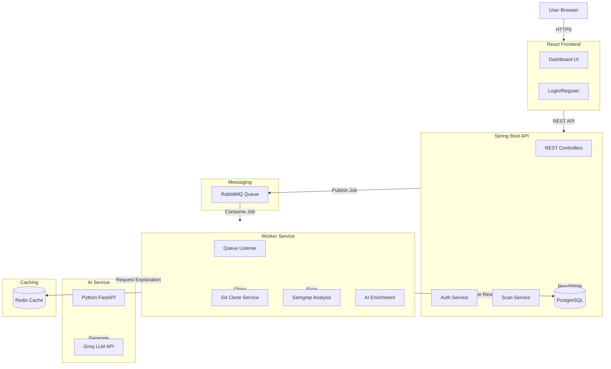

# DevSecWatch Architecture

## Data Flow
1.  User submits a repository URL via Frontend.
2.  Backend validates request and saves `Scan` (QUEUED) to DB.
3.  Backend publishes message to RabbitMQ.
4.  Worker consumes message.
5.  Worker clones repository to temp storage.
6.  Worker runs `semgrep` to identify vulnerabilities.
7.  Worker calls AI Service (checking Redis first) to get fixes.
8.  Worker saves findings to DB and updates Scan status (COMPLETED).
9.  Frontend polls Backend and displays results.
