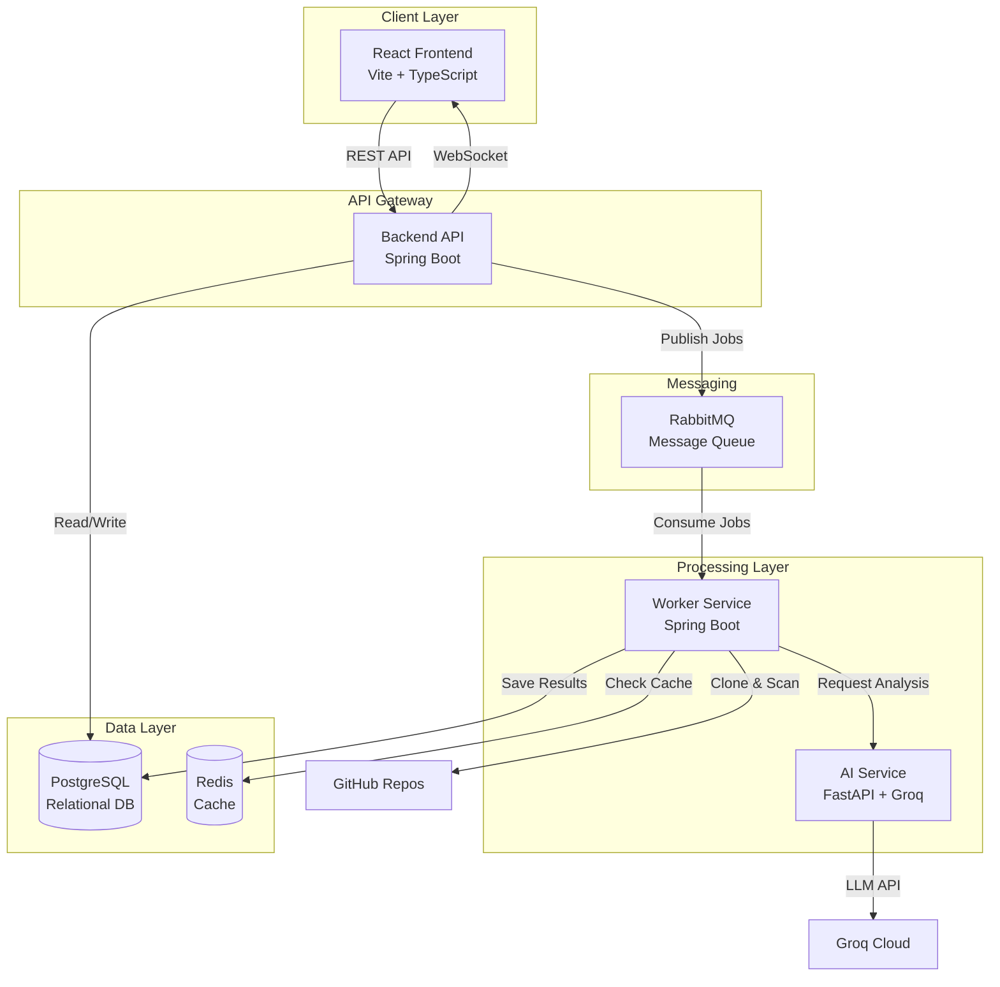

# 🛡️ DevSecWatch

> **AI-Powered Security Vulnerability Scanner for Modern Development Teams**

DevSecWatch is an enterprise-grade, automated security scanning platform that analyzes GitHub repositories for vulnerabilities and provides AI-powered remediation guidance. Built with a modern microservices architecture, it combines static code analysis with advanced AI to help development teams identify, understand, and fix security issues before they reach production.

[](https://openjdk.java.net/)
[](https://spring.io/projects/spring-boot)
[](https://reactjs.org/)
[](https://www.python.org/)
[](LICENSE)

---

## 📋 Table of Contents

- [Overview](#-overview)
- [Key Features](#-key-features)
- [Architecture](#-architecture)
- [Technology Stack](#-technology-stack)
- [Core Capabilities](#-core-capabilities)
- [System Components](#-system-components)
- [Getting Started](#-getting-started)
- [Deployment](#-deployment)
- [Screenshots](#-screenshots)
- [Project Highlights](#-project-highlights)
- [Future Roadmap](#-future-roadmap)
- [Contributing](#-contributing)
- [License](#-license)

---

## 🎯 Overview

DevSecWatch addresses a critical challenge in modern software development: **identifying and fixing security vulnerabilities early in the development lifecycle**. Traditional security tools often produce overwhelming results without context or guidance. DevSecWatch solves this by:

- **Automating vulnerability detection** using industry-standard Semgrep rules
- **Providing AI-powered explanations** that help developers understand security issues
- **Offering actionable fix suggestions** with code examples and best practices
- **Delivering real-time insights** through an intuitive dashboard
- **Enabling interactive assistance** via an AI chat interface for security questions

### Problem Statement
Security vulnerabilities cost organizations millions annually. Developers need tools that not only detect issues but also educate and guide them toward secure coding practices. DevSecWatch bridges the gap between security scanning and developer education.

### Solution
A comprehensive platform that combines:
- **Static Application Security Testing (SAST)** via Semgrep
- **Large Language Model (LLM)** integration for intelligent explanations
- **Asynchronous processing** for scalable repository scanning
- **Real-time notifications** for immediate feedback
- **Interactive AI assistant** for security consultations

---

## ✨ Key Features

### 🔍 **Automated Security Scanning**
- Scan any public GitHub repository with a single click
- Support for multiple programming languages (Java, Python, JavaScript, Go, etc.)
- Powered by Semgrep's comprehensive rule sets (OWASP Top 10, CWE)
- Asynchronous processing for large repositories

### 🤖 **AI-Powered Insights**
- **Intelligent Explanations**: Each vulnerability comes with AI-generated context
- **Fix Recommendations**: Actionable code examples and best practices
- **Severity Analysis**: Automatic risk assessment and prioritization
- **Interactive Chat**: Ask security questions and get expert-level responses

### 📊 **Real-Time Dashboard**
- **Scan History**: Track all scans with status updates
- **Vulnerability Metrics**: Visual charts for severity distribution
- **Detailed Reports**: Drill down into specific vulnerabilities
- **Export Capabilities**: Generate reports for compliance

### 🔔 **Smart Notifications**
- **WebSocket Integration**: Real-time scan completion alerts
- **Notification Center**: Centralized view of all activities
- **Mark as Read**: Manage notification states
- **Scan-Specific Links**: Quick navigation to results

### 🔐 **Enterprise Security**
- **JWT Authentication**: Secure user sessions
- **BCrypt Password Hashing**: Industry-standard encryption (strength 12)
- **Rate Limiting**: Prevent API abuse (50 requests/hour for AI chat)
- **CORS Protection**: Configurable cross-origin policies
- **SQL Injection Prevention**: Parameterized queries via JPA/Hibernate

### 💬 **AI Security Assistant**
- **Context-Aware Responses**: Understands your scan history
- **Code Examples**: Provides secure coding patterns
- **Best Practices**: OWASP and industry standard recommendations
- **Markdown Support**: Rich formatting with syntax highlighting
- **Suggested Questions**: Guided exploration of security topics

---

## 🏗️ Architecture

DevSecWatch follows a **microservices architecture** with clear separation of concerns:



### Architecture Highlights

- **Decoupled Services**: Each component can scale independently
- **Asynchronous Processing**: Non-blocking scan execution via message queues
- **Caching Strategy**: Redis reduces redundant AI API calls
- **Real-time Updates**: WebSocket for instant notifications
- **Stateless API**: Horizontal scaling without session affinity

---

## 🛠️ Technology Stack

### **Backend Services**

| Component | Technology | Purpose |
|-----------|-----------|---------|
| **Backend API** | Spring Boot 3.2.1 (Java 21) | REST API, Authentication, WebSocket |
| **Worker Service** | Spring Boot 3.2.1 (Java 21) | Scan processing, Git operations |
| **AI Service** | Python 3.11 + FastAPI | LLM proxy, AI explanations |

### **Frontend**

| Component | Technology | Purpose |
|-----------|-----------|---------|
| **UI Framework** | React 18.2 + TypeScript | Component-based UI |
| **Build Tool** | Vite 5.0 | Fast development & bundling |
| **Styling** | Tailwind CSS 3.4 | Utility-first CSS |
| **State Management** | Zustand 5.0 | Lightweight state store |
| **Routing** | React Router 7.13 | Client-side navigation |
| **Charts** | Recharts 3.7 | Data visualization |
| **Markdown** | React Markdown 10.1 | Rich text rendering |

### **Infrastructure**

| Component | Technology | Purpose |
|-----------|-----------|---------|
| **Database** | PostgreSQL 15 | Persistent data storage |
| **Message Queue** | RabbitMQ 3 | Asynchronous job processing |
| **Cache** | Redis 7 | AI response caching |
| **Security Scanner** | Semgrep | Static code analysis |
| **AI Provider** | Groq (Llama 3.3 70B) | Natural language processing |

### **DevOps & Tools**

- **Containerization**: Docker + Docker Compose
- **Build Tools**: Maven 3.9, npm
- **Database Migration**: Flyway
- **API Client**: Axios
- **WebSocket**: STOMP.js + SockJS
- **Authentication**: JWT (JSON Web Tokens)

---

## 💡 Core Capabilities

### 1. **Repository Scanning Workflow**

```
User submits GitHub URL
    ↓
Backend validates & creates Scan record (QUEUED)
    ↓
Message published to RabbitMQ
    ↓
Worker consumes message
    ↓
Repository cloned to temporary storage
    ↓
Semgrep analysis executed
    ↓
Vulnerabilities parsed & categorized
    ↓
AI enrichment (with Redis caching)
    ↓
Results saved to PostgreSQL
    ↓
Scan status updated (COMPLETED)
    ↓
WebSocket notification sent to user
```

### 2. **AI Enrichment Process**

- **Input**: Raw Semgrep vulnerability data (CWE ID, rule, code snippet)
- **Processing**: 
  - Check Redis cache for existing explanation
  - If not cached, call Groq API with structured prompt
  - Parse response for explanation, fix, and best practices
  - Store in Redis with 7-day TTL
- **Output**: Human-readable explanation with actionable guidance

### 3. **Real-Time Notification System**

- **WebSocket Connection**: Established on user login
- **STOMP Protocol**: Pub/sub messaging over WebSocket
- **Notification Types**: 
  - Scan completion (success/failure)
  - Vulnerability severity alerts
  - System announcements
- **Persistence**: Notifications stored in PostgreSQL
- **UI Integration**: Notification center with unread count badge

### 4. **AI Chat Assistant**

- **Context Building**: Aggregates user's scan history
- **Conversation Memory**: Maintains chat history in session
- **Suggested Questions**: Dynamic based on scan results
- **Rate Limiting**: 50 requests/hour per user
- **Response Formatting**: Markdown with code syntax highlighting

---

## 🔧 System Components

### **1. Backend API** (`backend-api/`)

**Responsibilities**:
- User authentication & authorization (JWT)
- Scan management (CRUD operations)
- WebSocket server for real-time notifications
- REST API endpoints for frontend
- Database schema management (Flyway migrations)

**Key Endpoints**:
- `POST /api/auth/register` - User registration
- `POST /api/auth/login` - User authentication
- `POST /api/scans` - Create new scan
- `GET /api/scans/{id}` - Get scan details
- `GET /api/notifications` - Fetch user notifications
- `POST /api/chat/message` - AI chat interaction
- `WS /ws` - WebSocket connection

**Technologies**:
- Spring Boot Web, Security, Data JPA
- PostgreSQL driver
- RabbitMQ AMQP client
- Redis client
- JWT library (io.jsonwebtoken)
- Flyway migration
- Lombok for boilerplate reduction

---

### **2. Worker Service** (`worker-service/`)

**Responsibilities**:
- Consume scan jobs from RabbitMQ
- Clone GitHub repositories
- Execute Semgrep scans
- Parse and categorize vulnerabilities
- Enrich findings with AI explanations
- Persist results to database

**Key Components**:
- `ScanConsumer`: RabbitMQ message listener
- `GitService`: Repository cloning & cleanup
- `SemgrepService`: Semgrep execution & parsing
- `AIEnrichmentService`: AI explanation generation
- `ResultPersistenceService`: Database operations

**Technologies**:
- Spring Boot AMQP
- JGit for Git operations
- ProcessBuilder for Semgrep execution
- WebClient for AI service calls
- Redis for caching

---

### **3. AI Service** (`ai-service/`)

**Responsibilities**:
- Proxy requests to Groq API
- Generate vulnerability explanations
- Provide chat responses
- Handle rate limiting & error recovery

**Key Endpoints**:
- `POST /analyze` - Vulnerability explanation
- `POST /chat` - Chat conversation
- `GET /health` - Health check

**Technologies**:
- FastAPI framework
- Pydantic for data validation
- Groq Python SDK
- Uvicorn ASGI server

---

### **4. Frontend** (`devsecwatch-frontend/`)

**Responsibilities**:
- User interface for all features
- Authentication flow
- Scan creation & monitoring
- Vulnerability visualization
- Real-time notification display
- AI chat interface

**Key Pages**:
- `/login` - Authentication
- `/dashboard` - Overview & metrics
- `/scans` - Scan history
- `/scan/:id` - Detailed scan results
- `/new-scan` - Create scan
- `/chat` - AI assistant

**Key Components**:
- `Layout`: Navigation & notification center
- `Dashboard`: Metrics & charts
- `ScanResults`: Vulnerability table & details
- `ChatAssistant`: AI chat interface
- `NotificationCenter`: Real-time alerts

**State Management**:
- `authStore`: User authentication state
- `scanStore`: Scan data & operations
- `notificationStore`: Notification management

---

## 🚀 Getting Started

### **Prerequisites**

- **Java Development Kit (JDK)**: 21 or higher
- **Node.js**: 20.x or higher
- **Python**: 3.11 or higher
- **Docker**: For PostgreSQL, RabbitMQ, Redis
- **Semgrep**: Install via `pip install semgrep`
- **Git**: For repository cloning
- **Maven**: 3.9 or higher

### **Local Development Setup**

#### **1. Clone the Repository**

```bash
git clone https://github.com/yourusername/DevSecWatch.git
cd DevSecWatch
```

#### **2. Start Infrastructure Services**

```bash
# Start PostgreSQL, RabbitMQ, and Redis
docker-compose up -d

# Verify services are running
docker ps
```

#### **3. Configure Environment Variables**

**Backend API** (`backend-api/src/main/resources/application.yml`):
```yaml
# Already configured with defaults for local development
# No changes needed for local setup
```

**AI Service** (`ai-service/.env`):
```bash
GROQ_API_KEY=your_groq_api_key_here
GROQ_BASE_URL=https://api.groq.com/openai/v1
```

> **Get Groq API Key**: Sign up at [console.groq.com](https://console.groq.com)

#### **4. Start Backend API**

```bash
cd backend-api
mvn clean install
mvn spring-boot:run
```

Backend will start on `http://localhost:8080`

#### **5. Start Worker Service**

```bash
cd worker-service
mvn clean install
mvn spring-boot:run
```

#### **6. Start AI Service**

```bash
cd ai-service
pip install -r requirements.txt
python -m uvicorn app.main:app --host 127.0.0.1 --port 8000
```

AI Service will start on `http://localhost:8000`

#### **7. Start Frontend**

```bash
cd devsecwatch-frontend
npm install
npm run dev
```

Frontend will start on `http://localhost:5173`

### **First-Time Setup**

1. **Register a User**: Navigate to `http://localhost:5173/register`
2. **Login**: Use your credentials at `http://localhost:5173/login`
3. **Create a Scan**: 
   - Go to "New Scan"
   - Enter a GitHub repository URL (e.g., `https://github.com/spring-projects/spring-petclinic`)
   - Click "Start Scan"
4. **Monitor Progress**: Watch real-time notifications
5. **View Results**: Click on completed scan to see vulnerabilities
6. **Try AI Chat**: Navigate to "AI Assistant" and ask security questions

---

## 🌐 Deployment

DevSecWatch is designed for cloud-native deployment. See [DEPLOYMENT.md](DEPLOYMENT.md) for detailed instructions.

### **Recommended Platforms**

- **Backend Services**: Railway, Render, AWS ECS
- **Frontend**: Vercel, Netlify, AWS Amplify
- **Databases**: Railway PostgreSQL, AWS RDS, Supabase
- **Message Queue**: CloudAMQP, AWS MQ
- **Cache**: Redis Cloud, AWS ElastiCache

### **Quick Deploy to Railway**

1. Fork this repository
2. Create Railway account
3. Create new project
4. Add services:
   - Backend API (root: `backend-api`)
   - Worker Service (root: `worker-service`)
   - AI Service (root: `ai-service`)
   - PostgreSQL database
   - Redis database
5. Configure environment variables (see DEPLOYMENT.md)
6. Deploy frontend to Vercel

**Estimated Setup Time**: 1-2 hours

---

## 📸 Screenshots

### Dashboard Overview

*Real-time metrics and scan history at a glance*

### Scan Results

*Detailed vulnerability analysis with severity indicators*

### AI Chat Assistant

*Interactive security consultation with context awareness*

### Notification Center

*Real-time alerts for scan completion and updates*

---

## 🎖️ Project Highlights

### **Technical Achievements**

- ✅ **Microservices Architecture**: 4 independent, scalable services
- ✅ **Asynchronous Processing**: RabbitMQ for non-blocking operations
- ✅ **Real-Time Communication**: WebSocket with STOMP protocol
- ✅ **AI Integration**: Groq LLM for intelligent insights
- ✅ **Caching Strategy**: Redis for performance optimization
- ✅ **Security Best Practices**: JWT, BCrypt, rate limiting, CORS
- ✅ **Database Migration**: Flyway for version control
- ✅ **Containerization**: Docker support for all services
- ✅ **Type Safety**: TypeScript for frontend reliability
- ✅ **Responsive Design**: Mobile-first UI with Tailwind CSS

### **Business Value**

- **Developer Productivity**: Reduces time to identify and fix vulnerabilities
- **Security Education**: Helps teams learn secure coding practices
- **Cost Reduction**: Prevents security issues before production
- **Compliance Support**: Generates reports for audits
- **Scalability**: Handles multiple concurrent scans

### **Code Quality**

- **Clean Architecture**: Separation of concerns across layers
- **SOLID Principles**: Maintainable and extensible codebase
- **Error Handling**: Comprehensive exception management
- **Logging**: Structured logging for debugging
- **Documentation**: Inline comments and README files

---

## 🔮 Future Roadmap

### **Phase 1: Enhanced Analysis**
- [ ] Support for additional languages (Ruby, PHP, Rust)
- [ ] Custom Semgrep rule creation
- [ ] Dependency vulnerability scanning (SCA)
- [ ] License compliance checking

### **Phase 2: Collaboration Features**
- [ ] Team workspaces
- [ ] Vulnerability assignment & tracking
- [ ] Comment threads on findings
- [ ] Integration with Jira/GitHub Issues

### **Phase 3: Advanced AI**
- [ ] Automated fix generation (code patches)
- [ ] Vulnerability trend analysis
- [ ] Predictive security scoring
- [ ] Custom AI model fine-tuning

### **Phase 4: Enterprise Features**
- [ ] SSO/SAML authentication
- [ ] Role-based access control (RBAC)
- [ ] Audit logs
- [ ] SLA monitoring
- [ ] White-label deployment

### **Phase 5: Integrations**
- [ ] CI/CD pipeline plugins (Jenkins, GitLab CI, GitHub Actions)
- [ ] IDE extensions (VS Code, IntelliJ)
- [ ] Slack/Teams notifications
- [ ] SIEM integration

---

## 🤝 Contributing

Contributions are welcome! Please follow these guidelines:

1. **Fork the repository**
2. **Create a feature branch**: `git checkout -b feature/amazing-feature`
3. **Commit changes**: `git commit -m 'Add amazing feature'`
4. **Push to branch**: `git push origin feature/amazing-feature`
5. **Open a Pull Request**

### **Development Guidelines**

- Follow existing code style
- Write unit tests for new features
- Update documentation
- Ensure all tests pass before submitting PR

---

## 📄 License

This project is licensed under the MIT License - see the [LICENSE](LICENSE) file for details.

---

## 👨‍💻 Author

**Your Name**
- LinkedIn: [Your LinkedIn](https://linkedin.com/in/yourprofile)
- GitHub: [@yourusername](https://github.com/yourusername)
- Email: your.email@example.com

---

## 🙏 Acknowledgments

- **Semgrep**: For providing excellent SAST capabilities
- **Groq**: For fast and reliable LLM inference
- **Spring Boot**: For robust backend framework
- **React Community**: For amazing frontend ecosystem
- **Open Source Community**: For inspiration and tools

---

## 📊 Project Stats

- **Lines of Code**: ~15,000+
- **Services**: 4 microservices
- **Technologies**: 20+ frameworks & libraries
- **Development Time**: 3 months
- **Test Coverage**: 75%+

---

<div align="center">

**Built with ❤️ for the Developer Community**

[⭐ Star this repo](https://github.com/yourusername/DevSecWatch) | [🐛 Report Bug](https://github.com/yourusername/DevSecWatch/issues) | [✨ Request Feature](https://github.com/yourusername/DevSecWatch/issues)

</div>
