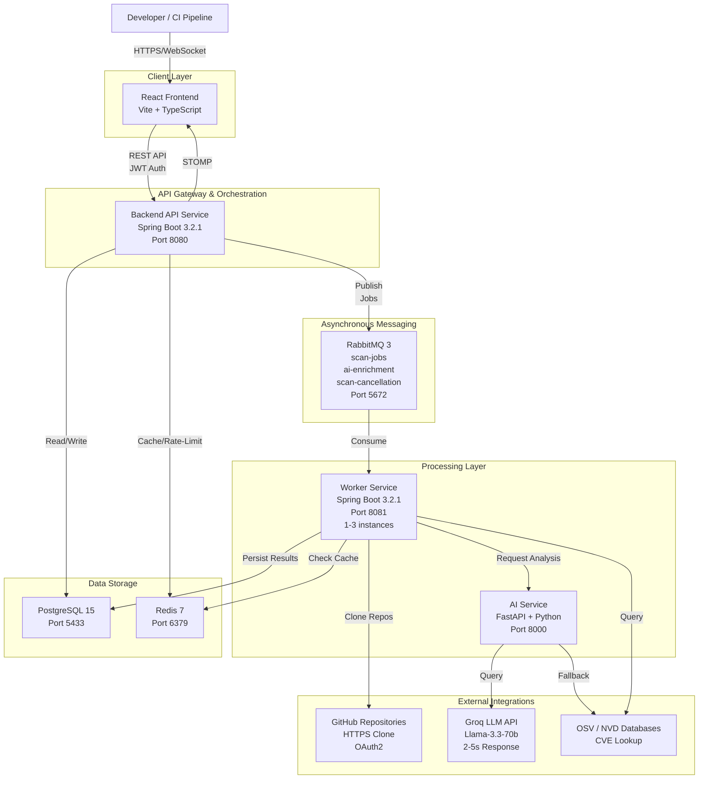

<div align="center">

# 🛡️ DevSecWatch
**AI-Powered, Enterprise-Grade Security Vulnerability Scanner**

[](https://reactjs.org/)
[](https://spring.io/projects/spring-boot)
[](https://fastapi.tiangolo.com/)
[](https://www.rabbitmq.com/)
[](https://www.postgresql.org/)
[](https://redis.io/)
[](https://opensource.org/licenses/MIT)

> **DevSecWatch analyzes GitHub repositories for vulnerabilities, automates static code analysis, and leverages Large Language Models (LLMs) to provide real-time, context-aware remediation guidance.**

</div>

---

## 📖 Table of Contents
- [🎯 Project Overview](#-project-overview)
- [✨ Key Features & Capabilities](#-key-features--capabilities)
- [🏗️ System Architecture](#️-system-architecture)
- [🔄 Detailed Data Flow](#-detailed-data-flow)
- [🛠️ Technology Stack](#️-technology-stack)
- [📂 Complete Repository Structure](#-complete-repository-structure)
- [🚀 Getting Started (Local Setup)](#-getting-started-local-setup)
- [🔌 API Documentation](#-api-documentation)
- [🌐 Deployment](#-deployment)
- [👨‍💻 Development Guide](#-development-guide)
- [🧪 Testing](#-testing)
- [🔐 Security & Performance](#-security--performance)
- [🤝 Contributing](#-contributing)
- [🔮 Future Roadmap](#-future-roadmap)
- [📄 License](#-license)

---

## 🎯 Project Overview

Traditional application security tools (SAST/SCA) often produce an overwhelming number of findings—leaving developers confused by false positives or vague descriptions of *why* the code is vulnerable. 

**DevSecWatch** bridges the gap between raw security findings and developer productivity by marrying industry-standard scanning tools with advanced AI. It not only identifies vulnerabilities using tools like Semgrep and OSV but deeply analyzes them using Groq's high-speed LLMs (Llama 3.3). DevSecWatch explains the vulnerability in plain English, evaluates the specific risk context, and automatically generates production-ready code patches.

### The Problem It Solves
1. **Context-less Vulnerabilities:** Developers get flagged for security flaws without understanding the underlying attack vectors.
2. **Slow Remediation:** Figuring out how to patch a vulnerability correctly can take hours of research.
3. **Tool Fragmentation:** Dealing with separate tools for SAST, SCA, and reporting.

### Why DevSecWatch?
- ✅ **Zero Configuration Scanning** - Analyze repos with a single URL
- ✅ **AI-Powered Insights** - Understand *why* code is vulnerable
- ✅ **Instant Fixes** - Get production-ready patches, not generic advice
- ✅ **Real-Time Feedback** - WebSocket-driven live progress updates
- ✅ **Enterprise-Ready** - Authentication, RBAC, rate limiting, scalable
- ✅ **Developer-First** - Beautiful UI, chat interface, quick remediation

---

## ✨ Key Features & Capabilities

### 🔍 1. Multi-Layered Security Scanning
- **Static Application Security Testing (SAST)** via Semgrep
  - 1000+ built-in rules covering OWASP Top 10
  - CWE and CVE pattern detection
  - Custom rule support via `.devsecwatch_secrets.yml`
  - Support for Java, Python, JavaScript, Go, Rust, C/C++, and more

- **Software Composition Analysis (SCA)** 
  - Maven (`pom.xml`), npm (`package.json`), Python (`requirements.txt`) parsing
  - OSV and NVD database integration for CVE lookup
  - Transitive dependency analysis
  - License compliance checking

- **Secret Detection**
  - Hardcoded credentials and API keys
  - Database connection strings
  - SSH keys and certificates
  - Private tokens

### 🤖 2. AI-Driven Remediation (Powered by Groq & Llama 3.3)
- **Smart Contextual Explanations**
  - The AI reads the actual vulnerable code snippet
  - Explains how an attacker might exploit it
  - Provides risk assessment for the specific context
  - 2-3 second response time via Groq API

- **Auto-Fix Generation**
  - Production-ready code patches (not pseudo-code)
  - Drop-in replacements for vulnerable patterns
  - Context-aware solutions respecting method signatures
  - Language-specific best practices

- **Interactive Security Copilot**
  - Built-in chat interface for vulnerability Q&A
  - Ask follow-up questions about specific findings
  - Request alternative patch implementations
  - Learn security best practices interactively

- **Graceful Degradation**
  - Template-based fallback explanations if AI unavailable
  - 8 pre-built templates for common vulnerability types
  - 7-day Redis cache for explanation reuse (40% cache hit rate)

### ⚡ 3. Real-Time & Asynchronous Processing
- **Event-Driven Microservices Architecture**
  - Heavy scanning tasks delegated to Worker nodes
  - Main API remains highly responsive (< 100ms response time)
  - RabbitMQ-based job queue with manual acknowledgment
  - Dead-letter queue for failed messages

- **WebSocket STOMP Notifications**
  - Live scan progress: Queued → Cloning → Scanning → AI Enrichment → Completed
  - Real-time progress percentage display
  - SockJS fallback for non-WebSocket browsers
  - Per-scan topic subscriptions for privacy

- **Intelligent Caching Layer**
  - Redis cache prevents redundant LLM calls
  - 7-day TTL on vulnerability explanations
  - Deduplication mechanism (rate limited to 1 scan per repo per 10 minutes)
  - Session token caching
  - Rate limit bucket tracking

### 👥 4. Enterprise Features
- **User Authentication & Authorization**
  - JWT-based stateless authentication (24-hour expiration)
  - GitHub OAuth2 social login integration
  - Role-based access control (USER, ADMIN)
  - Password hashing with Spring Security

- **Rate Limiting & Abuse Prevention**
  - Token bucket algorithm with Redis backend
  - 5 scans per 10 minutes per user
  - Prevents scan duplicates
  - DDoS protection at API gateway

- **User Isolation & Data Privacy**
  - Ownership verification on all scan operations
  - Multi-tenant database schema
  - User-scoped metrics and analytics
  - Audit logging of sensitive operations

- **Scalability Features**
  - Horizontal worker scaling (1-3 concurrent scanners)
  - Connection pooling for all data sources
  - Load balancing ready
  - Stateless API design

### 📊 5. Analytics & Insights
- **Security Score Calculation**
  - Formula: `100 - (critical×10 + high×5 + medium×2 + low×1)`
  - Normalized 0-100 scale
  - Trend analysis over time

- **Vulnerability Analytics**
  - Distribution by severity
  - Distribution by vulnerability type
  - Remediation tracking
  - Vulnerability timeline

- **Risk Profiling**
  - Team-wide security metrics
  - Vulnerability hotspots
  - False positive tracking
  - Remediation velocity

---

## 🏗️ System Architecture

### High-Level Microservices Diagram


```mermaid
graph TB
    User[Developer / CI Pipeline]
    
    subgraph "Client Layer"
        Frontend[React Frontend<br/>Vite + TypeScript]
    end
    
    subgraph "API Gateway & Orchestration"
        BackendAPI[Backend API Service<br/>Spring Boot 3.2.1<br/>Port 8080]
    end
    
    subgraph "Asynchronous Messaging"
        RabbitMQ["RabbitMQ 3<br/>scan-jobs<br/>ai-enrichment<br/>scan-cancellation<br/>Port 5672"]
    end
    
    subgraph "Processing Layer"
        Worker["Worker Service<br/>Spring Boot 3.2.1<br/>Port 8081<br/>1-3 instances"]
        AIService["AI Service<br/>FastAPI + Python<br/>Port 8000"]
    end
    
    subgraph "Data Storage"
        DB["PostgreSQL 15<br/>Port 5433"]
        Redis["Redis 7<br/>Port 6379"]
    end
    
    subgraph "External Integrations"
        GitHub["GitHub Repositories<br/>HTTPS Clone<br/>OAuth2"]
        GroqAPI["Groq LLM API<br/>Llama-3.3-70b<br/>2-5s Response"]
        OSV_NVD["OSV / NVD Databases<br/>CVE Lookup"]
    end
    
    User -->|HTTPS/WebSocket| Frontend
    Frontend -->|REST API<br/>JWT Auth| BackendAPI
    BackendAPI -->|Publish<br/>Jobs| RabbitMQ
    BackendAPI -->|Read/Write| DB
    BackendAPI -->|Cache/Rate-Limit| Redis
    BackendAPI -->|STOMP| Frontend
    
    RabbitMQ -->|Consume| Worker
    Worker -->|Clone Repos| GitHub
    Worker -->|Check Cache| Redis
    Worker -->|Persist Results| DB
    Worker -->|Request Analysis| AIService
    
    AIService -->|Query| GroqAPI
    AIService -->|Fallback| OSV_NVD
    
    Worker -->|Query| OSV_NVD
```

### Internal Component Details

#### 🖥️ Backend API Service (Spring Boot 3.2.1)
| Aspect | Details |
|--------|---------|
| **Port** | 8080 |
| **Java Version** | 21 |
| **Database** | PostgreSQL 15 with Flyway migrations |
| **Key Dependencies** | Spring Security, JPA, AMQP, WebFlux, OAuth2, WebSocket |
| **Architecture** | REST API with authentication, async job orchestration |

**Core Controllers:**
- `AuthController` - JWT/OAuth2 authentication, token refresh
- `ScanController` - Create, list, detail, cancel, delete scans
- `ChatController` - AI chat interaction
- `WebSocketController` - STOMP connection management

**Key Services:**
- `ScanService` - Orchestrates scan creation, job publishing, deduplication
- `AuthService` - JWT generation, GitHub OAuth2 handling
- `ChatService` - Relays messages to AI Service with context
- `WebSocketNotificationService` - Real-time progress broadcasting
- `RateLimitService` - Token bucket algorithm with Redis

#### 🔄 Worker Service (Spring Boot 3.2.1)
| Aspect | Details |
|--------|---------|
| **Port** | 8081 |
| **Concurrency** | 1-3 configurable workers |
| **Java Version** | 21 |
| **Key Dependencies** | Spring AMQP, JPA, JGit, Docker Java SDK |

**Message Listeners:**
1. **ScanWorker** (`scan-jobs` queue) - Main scan pipeline
   - Repository cloning via JGit
   - Semgrep SAST scanning (Docker-isolated)
   - Dependency scanning (OSV/NVD)
   - AI enrichment job publishing

2. **AiEnrichmentWorker** (`ai-enrichment` queue) - Background AI processing
   - Processes pending vulnerabilities asynchronously
   - Redis cache lookup for explanations
   - AI Service API calls
   - Batch processing for efficiency

3. **ScanCancellationListener** (`scan-cancellation` queue) - Graceful shutdown
   - Terminates running processes
   - Updates scan status to CANCELLED
   - Cleans up resources

**Key Services:**
- `SemgrepService` - Docker-based Semgrep execution with 300s timeout, 512MB memory limit
- `GitService` - JGit repository cloning with branch support
- `DependencyScanner` - Parses pom.xml, package.json, requirements.txt → queries OSV/NVD
- `AIEnrichmentService` - Orchestrates AI explanation requests with caching
- `GracefulShutdownService` - Handles SIGTERM for graceful worker termination

#### 🤖 AI Service (FastAPI + Python)
| Aspect | Details |
|--------|---------|
| **Port** | 8000 |
| **Language** | Python 3.11 |
| **LLM Provider** | Groq API (Llama-3.3-70b-versatile) |
| **Response Time** | 2-5 seconds per request |

**Endpoints:**
- `GET /health` - Service health check
- `POST /analyze` - Analyze single vulnerability with AI
- `POST /chat` - Interactive chat with LLM

**Services:**
- `LLMService` - Groq API integration with prompt engineering
- `ValidationService` - AI response quality validation
- Template system - 8 pre-built templates for fallback

#### 💾 Database Layer (PostgreSQL 15)
```sql
-- User Management
Users: id, username, email, password_hash, roles, created_at

-- Scans & Results
Scans: id, user_id, repo_url, branch, status, total_files, 
       lines_of_code, critical/high/medium/low_count, 
       error_message, created_at, started_at, completed_at

Vulnerabilities: id, scan_id, file_path, line_number, 
                 vulnerability_type, severity, confidence,
                 ai_status, description, code_snippet, 
                 fix_suggestion, cve_id, cvss_score,
                 is_template_explanation, created_at

ScanMetrics: id, scan_id, total_vulnerabilities, 
             high_severity_count, execution_time_ms

Notifications: id, user_id, message, status, created_at
```

**Indexing Strategy:**
- `scans(user_id, created_at)` - User scan queries
- `vulnerabilities(scan_id, severity)` - Severity filtering
- `users(username)` - Auth lookups

#### ⚙️ Caching Layer (Redis 7)
| Purpose | TTL | Key Format |
|---------|-----|------------|
| Vulnerability explanations | 7 days | `explanation:{rule_id}:{code_hash}` |
| Rate limit buckets | 10 min | `ratelimit:{username}` |
| Scan deduplication | 10 min | `scan-dedup:{repo_url}:{branch}` |
| Session tokens | 24 hours | `session:{token}` |

#### 📨 Message Queue (RabbitMQ 3)
| Queue | Consumer | Purpose |
|-------|----------|---------|
| `scan-jobs` | ScanWorker | Initial scan processing |
| `ai-enrichment` | AiEnrichmentWorker | Background AI enrichment |
| `scan-notifications` | WebSocket | Real-time UI updates |
| `scan-cancellation` | ScanCancellationListener | Graceful shutdown |
| `dlx.scan-jobs` | (DLX) | Failed message storage |

---

## 🔄 Detailed Data Flow

### Complete Scan Workflow

```
1. USER INITIATES SCAN
   Frontend → POST /api/scans { repoUrl: "https://github.com/user/repo", branch: "main" }
   
2. BACKEND VALIDATION & ORCHESTRATION
   BackendAPI receives request
   ├─ Validates GitHub URL format
   ├─ Checks rate limit (5/10min)
   ├─ Deduplicates (Redis lock: scan-dedup key)
   ├─ Creates Scan entity (status: QUEUED)
   ├─ Publishes ScanMessage → RabbitMQ[scan-jobs]
   └─ Returns Scan ID with 202 Accepted

3. FRONTEND SUBSCRIPTION
   Frontend subscribes to WebSocket
   └─ STOMP: /subscribe /topic/scans/{scanId}

4. WORKER CONSUMES JOB
   Worker[#1] receives ScanMessage from queue
   └─ Registers scan in ProcessRegistry

5. GIT CLONING PHASE
   GitService.clone(repoUrl, branch)
   ├─ Validates GitHub accessibility
   ├─ Clones to /tmp/devsecwatch/{scanId}
   ├─ Checks out specified branch
   ├─ Publishes WebSocket: "Cloning... 25%"
   └─ Duration: 5-30 seconds (repo size dependent)

6. SAST SCANNING PHASE (Semgrep)
   SemgrepService.scanRepository()
   ├─ Docker execution: returntocorp/semgrep:latest
   ├─ Memory limit: 512MB, CPU: 0.5 cores
   ├─ Timeout: 300 seconds
   ├─ Config: Semgrep auto-detect + custom rules
   ├─ Output: JSON with findings
   ├─ Creates Finding objects (severity, rule_id, code_snippet)
   ├─ Publishes WebSocket: "Running Semgrep... 50%"
   └─ Duration: 10-120 seconds (code volume dependent)

7. SCA SCANNING PHASE (Dependencies)
   DependencyScanner.scan()
   ├─ Maven: Parses pom.xml → queries OSV/NVD
   ├─ npm: Parses package.json → checks devDependencies + transitive
   ├─ Python: Parses requirements.txt → pip lookup
   ├─ Creates Finding objects for CVEs
   ├─ Publishes WebSocket: "Scanning dependencies... 75%"
   └─ Duration: 5-20 seconds (dependency count)

8. PERSISTENCE & AI ENRICHMENT SUBMISSION
   Worker persists findings with ai_status: PENDING
   ├─ Batches findings (10-1000 results typical)
   ├─ For each finding:
   │  ├─ Publishes AiEnrichmentMessage → RabbitMQ[ai-enrichment]
   │  ├─ Updates Scan status: IN_PROGRESS → ENRICHING
   │  └─ Publishes WebSocket: "Generating AI fixes... 90%"
   └─ Duration: 1-2 seconds

9. SCAN COMPLETION
   Worker completes, publishes WebSocket: "Scan Complete 100%"
   └─ Updates Scan status: COMPLETED

10. BACKGROUND: AI ENRICHMENT (Asynchronous)
    AiEnrichmentWorker processes queue
    For each AiEnrichmentMessage:
    ├─ Redis cache lookup: explanation:{rule_id}
    ├─ If HIT: Retrieve cached explanation
    ├─ If MISS:
    │  ├─ POST /api/ai/analyze {vulnerability_type, code_snippet, ...}
    │  ├─ AI Service processes via Groq API
    │  ├─ Validates response format
    │  ├─ Caches in Redis for 7 days
    │  └─ Duration: 2-5 seconds per vulnerability
    ├─ Updates Vulnerability:
    │  ├─ description, fix_suggestion
    │  ├─ ai_status: COMPLETED
    │  └─ confidence: AI_GENERATED or TEMPLATE
    └─ Publishes WebSocket: "Vulnerability explained..."

11. FRONTEND DISPLAYS RESULTS
    Frontend receives real-time updates
    ├─ Polls GET /api/scans/{scanId} for status
    ├─ Receives WebSocket messages on progress
    ├─ Fetches GET /api/scans/{scanId}/vulnerabilities
    └─ Renders vulnerability list with:
        ├─ Severity badges
        ├─ Code snippets with syntax highlighting
        ├─ AI explanations
        ├─ Fix suggestions
        └─ Confidence indicators
```

### Chat Interaction Flow

```
USER ASKS QUESTION
Frontend: POST /api/chat/message 
{
  "message": "How do I fix this SQL injection?",
  "history": [{user}, {assistant}, ...],
  "context": "SELECT * FROM users WHERE id = \" + input"
}
    ↓
BACKEND RELAY
BackendAPI:
├─ Validates JWT token
├─ Checks rate limit (per user)
└─ Forwards to AI Service
    ↓
AI SERVICE PROCESSING
AIService: POST /chat (via FastAPI)
├─ Builds conversation with system prompt
├─ Includes vulnerability context
├─ Sends to Groq LLM API
└─ Duration: 2-5 seconds
    ↓
RESPONSE STREAMING
Frontend receives response in chunks
├─ Displays typing indicator
├─ Renders markdown with code highlighting
└─ Updates conversation history
```

---

## 🛠️ Technology Stack

### Backend Services
| Layer | Technology | Version | Purpose |
|-------|-----------|---------|---------|
| **Framework** | Spring Boot | 3.2.1 | REST API, async processing |
| **Language** | Java | 21 | Type safety, performance |
| **Authentication** | Spring Security + JWT | 0.12.5 | Stateless auth |
| **Database ORM** | Spring JPA + Hibernate | Latest | Object-relational mapping |
| **Job Queue** | RabbitMQ | 3 | Async message processing |
| **Caching** | Redis | 7 | Distributed cache |
| **Git Operations** | JGit | 6.8.0 | Repository cloning |
| **SAST Tool** | Semgrep | Latest | Static analysis |
| **Build Tool** | Maven | 3.9+ | Dependency management |

### Frontend
| Layer | Technology | Version | Purpose |
|-------|-----------|---------|---------|
| **Framework** | React | 18 | Component-based UI |
| **Language** | TypeScript | 5 | Type safety |
| **Build Tool** | Vite | 5 | Fast bundling |
| **Styling** | TailwindCSS | 3.4.1 | Utility-first CSS |
| **State Management** | Zustand | 5 | Lightweight stores |
| **HTTP Client** | Axios | 1.13.2 | API requests |
| **WebSocket** | @stomp/stompjs | 7.2.1 | Real-time updates |
| **Markdown** | react-markdown | 10.1.0 | Rendering |
| **Syntax Highlighting** | react-syntax-highlighter | 16.1.0 | Code display |
| **Charts** | Recharts | 3.7.0 | Analytics |
| **Icons** | lucide-react | 0.563 | UI icons |
| **UI Components** | Radix UI | Latest | Accessible components |

### AI & LLM
| Component | Technology | Version | Purpose |
|-----------|-----------|---------|---------|
| **LLM Provider** | Groq | Latest | Llama-3.3 inference |
| **API Framework** | FastAPI | 0.109.0 | Python web server |
| **Server** | Uvicorn | 0.27.0 | ASGI server |
| **LLM SDK** | groq-python | 0.4.1 | Groq API client |
| **Data Validation** | Pydantic | 2.5.3 | Request/response validation |
| **Cache Client** | redis-py | 5.0.1 | Redis interface |

### Infrastructure & Data
| Component | Technology | Version | Purpose |
|-----------|-----------|---------|---------|
| **Database** | PostgreSQL | 15 | Relational storage |
| **Cache** | Redis | 7 | In-memory caching |
| **Message Queue** | RabbitMQ | 3 | Async messaging |
| **Container Runtime** | Docker | Latest | Sandboxed Semgrep |
| **Deployment** | Railway / Vercel | - | Cloud hosting |

---

## 📂 Complete Repository Structure

```
DevSecWatch/
├── README.md                                # Main documentation
├── ARCHITECTURE.md                          # System design details
├── DEPLOYMENT.md                            # Deployment guide
├── docker-compose.yml                       # Local development stack
├── start_all.ps1                           # PowerShell startup script
├── test_apis.py                            # Integration test suite
├── semgrep_report.json                     # Sample Semgrep output
│
├── backend-api/                            # Spring Boot REST API
│   ├── pom.xml                            # Maven configuration (Java 21)
│   ├── Dockerfile                         # Docker image
│   ├── README.md                          # Service documentation
│   └── src/main/
│       ├── java/com/devsecwatch/backend/
│       │   ├── DeveloperApi.java         # Main Spring Boot app
│       │   ├── config/                   # Spring configuration
│       │   │   ├── CorsConfig.java
│       │   │   ├── SecurityConfig.java
│       │   │   ├── WebSocketConfig.java
│       │   │   └── RabbitmqConfig.java
│       │   ├── controller/               # REST endpoints
│       │   │   ├── AuthController.java
│       │   │   ├── ScanController.java
│       │   │   ├── ChatController.java
│       │   │   └── WebSocketController.java
│       │   ├── service/                  # Business logic
│       │   │   ├── ScanService.java
│       │   │   ├── AuthService.java
│       │   │   ├── ChatService.java
│       │   │   ├── RateLimitService.java
│       │   │   └── WebSocketNotificationService.java
│       │   ├── model/                    # JPA entities
│       │   │   ├── User.java
│       │   │   ├── Scan.java
│       │   │   ├── Vulnerability.java
│       │   │   ├── ScanMetrics.java
│       │   │   └── Notification.java
│       │   ├── repository/               # Data access layer
│       │   │   ├── UserRepository.java
│       │   │   ├── ScanRepository.java
│       │   │   ├── VulnerabilityRepository.java
│       │   │   └── ScanMetricsRepository.java
│       │   ├── dto/                      # Data transfer objects
│       │   │   ├── ScanRequest.java
│       │   │   ├── ScanResponse.java
│       │   │   ├── ChatRequest.java
│       │   │   └── ChatResponse.java
│       │   ├── security/                 # Authentication
│       │   │   ├── JwtUtil.java
│       │   │   ├── JwtFilter.java
│       │   │   └── OAuth2Handler.java
│       │   └── message/                  # RabbitMQ messages
│       │       ├── ScanMessage.java
│       │       ├── AiEnrichmentMessage.java
│       │       └── ScanCancellationMessage.java
│       └── resources/
│           ├── application.yml           # Default configuration
│           ├── application-prod.yml      # Production config
│           └── db/migration/             # Flyway migrations
│               └── V1__Initial_Schema.sql
│
├── worker-service/                         # Spring Boot scan processor
│   ├── pom.xml                           # Maven configuration
│   ├── Dockerfile                        # Docker image
│   ├── README.md                         # Service documentation
│   └── src/main/
│       ├── java/com/devsecwatch/worker/
│       │   ├── WorkerServiceApplication.java
│       │   ├── listener/                 # RabbitMQ listeners
│       │   │   ├── ScanWorker.java
│       │   │   ├── AiEnrichmentWorker.java
│       │   │   └── ScanCancellationListener.java
│       │   ├── service/                  # Processing services
│       │   │   ├── SemgrepService.java
│       │   │   ├── GitService.java
│       │   │   ├── DependencyScanner.java
│       │   │   ├── AIEnrichmentService.java
│       │   │   ├── ScanProcessRegistry.java
│       │   │   └── GracefulShutdownService.java
│       │   ├── model/                    # Data models
│       │   │   ├── Finding.java
│       │   │   ├── SemgrepResult.java
│       │   │   ├── EnrichedFinding.java
│       │   │   └── AIExplanation.java
│       │   └── repository/               # Database access
│       │       └── (uses backend entities)
│       └── resources/
│           ├── application.yml
│           └── application-prod.yml
│
├── ai-service/                            # FastAPI AI processor
│   ├── requirements.txt                  # Python dependencies
│   ├── Dockerfile                        # Docker image
│   ├── README.md                         # Service documentation
│   ├── .env.example                      # Environment template
│   └── app/
│       ├── main.py                       # FastAPI application
│       ├── config.py                     # Configuration (Pydantic)
│       ├── models.py                     # Request/response models
│       │   ├── AnalysisRequest
│       │   ├── AnalysisResponse
│       │   ├── ChatRequest
│       │   ├── ChatResponse
│       │   └── HealthResponse
│       ├── services/
│       │   ├── llm_service.py           # Groq API integration
│       │   └── validation_service.py    # Response validation
│       └── templates/
│           └── explanations.py          # Template explanations
│               ├── SQL_INJECTION
│               ├── HARDCODED_CREDENTIALS
│               ├── XSS
│               ├── PATH_TRAVERSAL
│               ├── XXE
│               ├── COMMAND_INJECTION
│               ├── INSECURE_DESERIALIZATION
│               └── (DEFAULT template)
│
├── devsecwatch-frontend/                  # React SPA
│   ├── package.json                     # Node dependencies
│   ├── tsconfig.json                    # TypeScript config
│   ├── vite.config.ts                   # Vite bundler config
│   ├── tailwind.config.js               # TailwindCSS config
│   ├── index.html                       # HTML entry point
│   ├── README.md                        # Frontend docs
│   └── src/
│       ├── main.tsx                     # React entry
│       ├── App.tsx                      # Root component
│       ├── vite-env.d.ts               # Vite type definitions
│       ├── pages/
│       │   ├── Login.tsx                # Email/password auth
│       │   ├── Register.tsx             # Account creation
│       │   ├── AuthCallback.tsx         # GitHub OAuth handler
│       │   ├── Dashboard.tsx            # Scan list + overview
│       │   ├── NewScan.tsx              # Create scan form
│       │   ├── ScanDetail.tsx           # Vulnerability details
│       │   ├── ChatAssistant.tsx        # AI chat interface
│       │   └── Analytics.tsx            # Trends + metrics
│       ├── components/
│       │   ├── Layout.tsx               # App layout wrapper
│       │   ├── ThemeToggle.tsx          # Dark/light mode
│       │   ├── NotificationCenter.tsx   # Toast notifications
│       │   └── chat/
│       │       ├── ChatInput.tsx
│       │       ├── ChatMessage.tsx
│       │       ├── CodeBlock.tsx
│       │       ├── SuggestedQuestions.tsx
│       │       └── TypingIndicator.tsx
│       ├── services/
│       │   ├── api.ts                   # Axios instance + interceptors
│       │   ├── auth.ts                  # Authentication service
│       │   ├── scan.ts                  # Scan operations
│       │   ├── chatService.ts           # Chat API calls
│       │   └── analytics.ts             # Analytics data
│       ├── hooks/
│       │   ├── useChat.ts               # Chat state logic
│       │   └── useWebSocket.ts          # WebSocket connection
│       ├── store/                       # Zustand state management
│       │   ├── authStore.ts
│       │   ├── scanStore.ts
│       │   ├── notificationStore.ts
│       │   └── themeStore.ts
│       ├── types/
│       │   └── index.ts                 # TypeScript interfaces
│       ├── assets/                      # Static files
│       └── styles/
│           ├── App.css
│           └── index.css
│
├── test-repo/                            # Test fixture repository
│   ├── package.json                     # Example npm vulnerabilities
│   ├── requirements.txt                 # Example Python vulns
│   ├── Secret.java                      # Hardcoded secrets example
│   └── SqlInjection.java                # SQL injection example
│
└── DevSecWatch/                          # Legacy backend folder
    └── (Mirror of backend-api)
```

---

## 🚀 Getting Started (Local Setup)

### Prerequisites

```bash
# Ensure you have these installed:
- Java Development Kit (JDK) 21+
- Maven 3.9+
- Node.js 18+
- npm 10+
- Docker & Docker Compose
- Python 3.11+
- Git
- Groq API Key (get from https://console.groq.com)
```

### Option 1: Docker Compose (Recommended)

```bash
# 1. Clone repository
git clone https://github.com/yourusername/devsecwatch.git
cd devsecwatch

# 2. Start all services
docker-compose up -d

# Services will be available at:
# - Frontend:    http://localhost:5173 (Vite dev server)
# - Backend:     http://localhost:8080
# - Worker:      http://localhost:8081
# - AI Service:  http://localhost:8000
# - RabbitMQ:    http://localhost:15672 (guest/guest)
# - PostgreSQL:  localhost:5433 (postgres/postgres)
# - Redis:       localhost:6379

# 3. Initialize database
curl -X GET http://localhost:8080/api/health

# 4. Test the system
python test_apis.py
```

### Option 2: Manual Local Development

#### Backend API
```bash
cd backend-api

# Build
mvn clean package

# Run
java -jar target/backend-api-0.0.1-SNAPSHOT.jar

# Or run with Maven
mvn spring-boot:run

# Available at: http://localhost:8080
# Health check: http://localhost:8080/actuator/health
```

#### Worker Service
```bash
cd worker-service

# Build
mvn clean package

# Run
java -jar target/worker-service-0.0.1-SNAPSHOT.jar

# Or with Maven
mvn spring-boot:run
```

#### AI Service
```bash
cd ai-service

# Create virtual environment
python -m venv venv

# Activate (Linux/Mac)
source venv/bin/activate

# Activate (Windows)
venv\Scripts\activate

# Install dependencies
pip install -r requirements.txt

# Set environment variables
export GROQ_API_KEY="your-groq-api-key"
export BACKEND_URL="http://localhost:8080"

# Run
python -m uvicorn app.main:app --reload --port 8000
```

#### Frontend
```bash
cd devsecwatch-frontend

# Install dependencies
npm install

# Start dev server
npm run dev

# Available at: http://localhost:5173
```

### Environment Configuration

Create `.env` files for each service:

**backend-api/.env**
```env
SPRING_DATASOURCE_URL=jdbc:postgresql://localhost:5433/devsecwatch
SPRING_DATASOURCE_USERNAME=postgres
SPRING_DATASOURCE_PASSWORD=postgres
SPRING_RABBITMQ_HOST=localhost
SPRING_RABBITMQ_PORT=5672
SPRING_DATA_REDIS_URL=redis://localhost:6379
JWT_SECRET=your-super-secret-jwt-key-min-64-chars-long!!!!
FRONTEND_URL=http://localhost:5173
```

**ai-service/.env**
```env
GROQ_API_KEY=gsk_xxxxx
BACKEND_URL=http://localhost:8080
REDIS_URL=redis://localhost:6379
```

**devsecwatch-frontend/.env**
```env
VITE_API_URL=http://localhost:8080
```

### Verify Installation

```bash
# Health checks
curl http://localhost:8080/actuator/health
curl http://localhost:8000/health
curl http://localhost:5173

# Create test scan
curl -X POST http://localhost:8080/api/scans \
  -H "Content-Type: application/json" \
  -H "Authorization: Bearer {token}" \
  -d '{"repoUrl": "https://github.com/spring-projects/spring-petclinic"}'
```

---

## 🔌 API Documentation

### Authentication Endpoints

#### Register New User
```http
POST /api/auth/register
Content-Type: application/json

{
  "username": "john_doe",
  "email": "john@example.com",
  "password": "SecurePassword123!"
}

Response: 201 Created
{
  "accessToken": "eyJhbGciOiJIUzI1NiIs...",
  "refreshToken": "eyJhbGciOiJIUzI1NiIs...",
  "user": {
    "id": 1,
    "username": "john_doe",
    "email": "john@example.com",
    "roles": ["USER"]
  }
}
```

#### Login with Email/Password
```http
POST /api/auth/login
Content-Type: application/json

{
  "email": "john@example.com",
  "password": "SecurePassword123!"
}

Response: 200 OK
{
  "accessToken": "eyJhbGciOiJIUzI1NiIs...",
  "refreshToken": "eyJhbGciOiJIUzI1NiIs...",
  "user": { ... }
}
```

#### Refresh Token
```http
POST /api/auth/refresh
Content-Type: application/json

{
  "refreshToken": "eyJhbGciOiJIUzI1NiIs..."
}

Response: 200 OK
{
  "accessToken": "eyJhbGciOiJIUzI1NiIs...",
  "refreshToken": "eyJhbGciOiJIUzI1NiIs..."
}
```

### Scan Endpoints

#### Create New Scan
```http
POST /api/scans
Authorization: Bearer {accessToken}
Content-Type: application/json

{
  "repoUrl": "https://github.com/user/repository",
  "branch": "main"  # optional, defaults to 'main'
}

Response: 202 Accepted
{
  "id": 123,
  "userId": 1,
  "repoUrl": "https://github.com/user/repository",
  "branch": "main",
  "status": "QUEUED",
  "createdAt": "2026-05-25T10:30:00Z",
  "startedAt": null,
  "completedAt": null
}
```

#### List User Scans
```http
GET /api/scans?page=0&size=20
Authorization: Bearer {accessToken}

Response: 200 OK
{
  "content": [
    {
      "id": 123,
      "repoUrl": "https://github.com/user/repository",
      "status": "COMPLETED",
      "totalVulnerabilities": 15,
      "criticalCount": 2,
      "highCount": 5,
      "mediumCount": 6,
      "lowCount": 2,
      "createdAt": "2026-05-25T10:30:00Z"
    },
    ...
  ],
  "totalElements": 42,
  "totalPages": 3,
  "currentPage": 0
}
```

#### Get Scan Details
```http
GET /api/scans/123
Authorization: Bearer {accessToken}

Response: 200 OK
{
  "id": 123,
  "userId": 1,
  "repoUrl": "https://github.com/user/repository",
  "status": "COMPLETED",
  "totalFiles": 245,
  "linesOfCode": 18500,
  "totalVulnerabilities": 15,
  "criticalCount": 2,
  "highCount": 5,
  "mediumCount": 6,
  "lowCount": 2,
  "startedAt": "2026-05-25T10:31:00Z",
  "completedAt": "2026-05-25T10:45:30Z",
  "metrics": {
    "executionTimeMs": 870000,
    "scannerVersion": "1.0.0"
  }
}
```

#### Get Scan Vulnerabilities
```http
GET /api/scans/123/vulnerabilities?severity=CRITICAL&type=SQL_INJECTION
Authorization: Bearer {accessToken}

Response: 200 OK
{
  "vulnerabilities": [
    {
      "id": 456,
      "scanId": 123,
      "filePath": "src/main/java/com/example/UserDAO.java",
      "lineNumber": 42,
      "vulnerabilityType": "SQL_INJECTION",
      "severity": "CRITICAL",
      "confidence": "AI_GENERATED",
      "description": "This SQL query concatenates user input without parameterization...",
      "codeSnippet": "String query = \"SELECT * FROM users WHERE id = \" + userId;",
      "fixSuggestion": "Use PreparedStatement: stmt.setString(1, userId);",
      "cveId": "CVE-2023-12345",
      "cvssScore": 9.8,
      "aiStatus": "COMPLETED",
      "createdAt": "2026-05-25T10:45:20Z"
    },
    ...
  ]
}
```

#### Cancel Scan
```http
POST /api/scans/123/cancel
Authorization: Bearer {accessToken}

Response: 200 OK
{
  "id": 123,
  "status": "CANCELLED",
  "message": "Scan cancelled successfully"
}
```

#### Delete Scan
```http
DELETE /api/scans/123
Authorization: Bearer {accessToken}

Response: 204 No Content
```

### Chat Endpoints

#### Send Chat Message
```http
POST /api/chat/message
Authorization: Bearer {accessToken}
Content-Type: application/json

{
  "message": "How do I fix this SQL injection vulnerability?",
  "history": [
    {"role": "user", "content": "What vulnerabilities were found?"},
    {"role": "assistant", "content": "Found 3 SQL injection issues..."}
  ],
  "context": "Vulnerability: SQL_INJECTION in line 42 of UserDAO.java"
}

Response: 200 OK
{
  "response": "To fix this SQL injection, you should use parameterized queries. Here's how...",
  "model": "llama-3.3-70b-versatile"
}
```

#### Test Authentication
```http
GET /api/chat/test-auth
Authorization: Bearer {accessToken}

Response: 200 OK
{
  "authenticated": true,
  "username": "john_doe",
  "authorities": ["USER"]
}
```

### WebSocket Endpoints

#### Connect & Subscribe
```javascript
// Connect to WebSocket
const stompClient = new StompClient({
  brokerURL: "ws://localhost:8080/ws"
});

stompClient.onConnect = () => {
  // Subscribe to scan updates
  stompClient.subscribe("/topic/scans/123", (message) => {
    const update = JSON.parse(message.body);
    console.log(update);
    // {
    //   scanId: 123,
    //   status: "IN_PROGRESS",
    //   message: "Cloning repository...",
    //   progress: 25
    // }
  });
};

stompClient.activate();
```

### Health Check Endpoints

#### Backend Health
```http
GET /actuator/health
Response: 200 OK
{
  "status": "UP",
  "components": {
    "db": {"status": "UP"},
    "rabbitmq": {"status": "UP"},
    "redis": {"status": "UP"}
  }
}
```

#### AI Service Health
```http
GET http://localhost:8000/health
Response: 200 OK
{
  "status": "healthy",
  "version": "1.0.0",
  "llm_service": "groq"
}
```

---

## 🌐 Deployment

See [DEPLOYMENT.md](DEPLOYMENT.md) for complete cloud deployment instructions (Railway, Vercel, AWS, etc.)

### Quick Deployment Checklist

**Prerequisites:**
- [x] PostgreSQL database (Cloud provider or managed service)
- [x] RabbitMQ instance
- [x] Redis instance
- [x] Groq API key
- [x] GitHub OAuth credentials
- [x] Docker registry (optional)

**Cloud Platforms:**
```
Option 1: Railway (All-in-one)
- Push to GitHub
- Connect via Railway dashboard
- Set environment variables
- Deploy

Option 2: AWS
- RDS for PostgreSQL
- ElastiCache for Redis
- EC2 or ECS for services
- API Gateway + ALB

Option 3: Vercel (Frontend only)
- Connect GitHub repo
- Set VITE_API_URL env var
- Deploy

Option 4: Docker Swarm / Kubernetes
- Build Docker images
- Push to registry
- Deploy manifests
```

### Environment Variables for Deployment

**Backend API**
```env
SPRING_DATASOURCE_URL=jdbc:postgresql://db-host:5432/devsecwatch
SPRING_DATASOURCE_USERNAME=prod_user
SPRING_DATASOURCE_PASSWORD=strong_password
SPRING_RABBITMQ_HOST=rabbitmq-host
SPRING_DATA_REDIS_URL=redis://redis-host:6379
JWT_SECRET=<generated-64-char-key>
FRONTEND_URL=https://app.devsecwatch.com
GITHUB_CLIENT_ID=<GitHub App ID>
GITHUB_CLIENT_SECRET=<GitHub App Secret>
```

**Worker Service**
```env
Same as Backend, plus:
AI_SERVICE_URL=http://ai-service:8000
TEMP_DIR=/tmp/devsecwatch
```

**AI Service**
```env
GROQ_API_KEY=gsk_xxxxx
BACKEND_URL=https://api.devsecwatch.com
REDIS_URL=redis://redis-host:6379
```

**Frontend**
```env
VITE_API_URL=https://api.devsecwatch.com
```

---

## 👨‍💻 Development Guide

### Project Structure Overview
- **backend-api/**: REST API orchestration & data management
- **worker-service/**: Async scan processing & AI enrichment
- **ai-service/**: LLM wrapper & validation
- **devsecwatch-frontend/**: React SPA user interface

### Development Workflow

#### Backend Development
```bash
cd backend-api

# Build locally
mvn clean package

# Run with debug
mvn spring-boot:run -Dspring-boot.run.arguments="--debug"

# Run tests
mvn test

# Code style
mvn spotless:apply
```

#### Worker Development
```bash
cd worker-service

# Build
mvn clean package

# Test Semgrep integration
mvn test -Dtest=SemgrepServiceTest

# Check Docker availability
docker ps
```

#### AI Service Development
```bash
cd ai-service

# Install dev dependencies
pip install -r requirements.txt
pip install pytest pytest-asyncio

# Run tests
pytest tests/ -v

# Test Groq integration
python -m pytest tests/test_llm_service.py -v
```

#### Frontend Development
```bash
cd devsecwatch-frontend

# Start dev server with hot reload
npm run dev

# Build for production
npm run build

# Preview production build
npm run preview

# Lint & format
npm run lint
```

### Code Conventions

**Java:**
- Follow Spring conventions (PascalCase for classes, camelCase for methods)
- Use Lombok annotations for boilerplate
- Add `@Transactional` for database operations
- Validate input with `@Valid` and custom validators

**Python:**
- Follow PEP 8 style guide
- Use type hints for all functions
- Add docstrings for classes and public methods
- Use async/await for I/O operations

**TypeScript:**
- Strict mode enabled
- Define interfaces for all data structures
- Use arrow functions for consistency
- Prop spreading for component composition

**Database:**
- Migrations via Flyway (Java) with V{N}__{description}.sql naming
- Use meaningful column names and indexes
- Add NOT NULL constraints where appropriate
- Foreign keys with ON DELETE CASCADE/RESTRICT

### Adding New Vulnerability Types

1. **Add template** (ai-service/app/templates/explanations.py)
```python
def get_template(vuln_type: str):
    templates = {
        "NEW_VULN_TYPE": {
            "description": "Plain English explanation...",
            "fix": "Code example for fix..."
        }
    }
```

2. **Add Semgrep rule** (worker-service config)
3. **Update frontend** (ScanDetail component)
4. **Test** - Run test suite

### Testing

**Backend:**
```bash
mvn test

# Specific test class
mvn test -Dtest=ScanControllerTest

# With coverage
mvn test jacoco:report
```

**Frontend:**
```bash
# Run tests (if Jest configured)
npm test

# Watch mode
npm test -- --watch
```

**Integration:**
```bash
# Run full stack tests
python test_apis.py
```

---

## 🧪 Testing

### Unit Tests
- Backend: JUnit 5 + Mockito
- Frontend: Jest (if configured)
- AI Service: pytest

### Integration Tests
```bash
# Full stack test
python test_apis.py

# Specific test
python test_apis.py TestScanCreation

# With logging
python test_apis.py -v
```

### Test Coverage
```bash
# Backend
mvn test jacoco:report
# Report: backend-api/target/site/jacoco/index.html

# Frontend
npm test -- --coverage
```

### Test Repositories
- `test-repo/` contains sample vulnerable code
- `semgrep_report.json` shows expected scan output

---

## 🔐 Security & Performance

### Security Measures
✅ JWT + Spring Security for authentication
✅ HTTPS for all communications
✅ CORS restrictions
✅ Rate limiting (5 scans per 10 minutes)
✅ SQL injection prevention via JPA parameterized queries
✅ XSS prevention via React escaping + DOMPurify
✅ CSRF protection via Spring Security
✅ Input validation on all endpoints
✅ Secrets detection during scans
✅ Docker sandboxing for Semgrep

### Performance Optimizations
✅ Redis caching (7-day TTL on explanations)
✅ Database connection pooling (HikariCP)
✅ RabbitMQ async processing
✅ Vite fast bundling + code splitting
✅ Pagination for large result sets
✅ Lazy loading on frontend
✅ Gzip compression for responses
✅ CDN-ready static assets

### Monitoring & Logging
- Spring Actuator metrics: `/actuator/prometheus`
- Application logs: `{service}/logs/`
- Database query logging (dev only)
- RabbitMQ management UI: `http://localhost:15672`

---

## 🤝 Contributing

Contributions welcome! Please:

1. Fork the repository
2. Create feature branch: `git checkout -b feature/your-feature`
3. Commit changes: `git commit -am 'Add new feature'`
4. Push to branch: `git push origin feature/your-feature`
5. Submit pull request

### Code Review Checklist
- [ ] Code follows project conventions
- [ ] Tests pass locally
- [ ] No breaking changes
- [ ] Documentation updated
- [ ] Security implications reviewed

---

## 🔮 Future Roadmap

### Phase 2 - Enhanced Scanning
- [ ] GitLab & Bitbucket support
- [ ] Container image scanning (Trivy integration)
- [ ] Infrastructure-as-Code scanning (Terraform/CloudFormation)
- [ ] Dynamic Application Security Testing (DAST)
- [ ] Secrets rotation recommendations

### Phase 3 - Intelligence & Insights
- [ ] Machine learning-based false positive filtering
- [ ] Vulnerability correlation & clustering
- [ ] Risk scoring by business impact
- [ ] Threat intel integration (Shodan, CVE feeds)
- [ ] Benchmark against industry standards

### Phase 4 - Developer Experience
- [ ] IDE plugins (VS Code, IntelliJ)
- [ ] Git pre-commit hooks
- [ ] CLI tool for local scanning
- [ ] Slack/Teams bot integration
- [ ] Scheduled recurring scans

### Phase 5 - Enterprise Features
- [ ] Multi-tenant SaaS platform
- [ ] SAML/Active Directory integration
- [ ] Audit logging & compliance reports
- [ ] Custom remediation workflows
- [ ] On-premises deployment guide

---

## 📄 License

MIT License - See LICENSE file for details

---

## 🙋 Support & Documentation

- **Issues:** GitHub Issues
- **Discussions:** GitHub Discussions
- **Docs:** [ARCHITECTURE.md](ARCHITECTURE.md) | [DEPLOYMENT.md](DEPLOYMENT.md)
- **Email:** support@devsecwatch.dev

---

**Last Updated:** May 25, 2026
**Maintained by:** DevSecWatch Team

